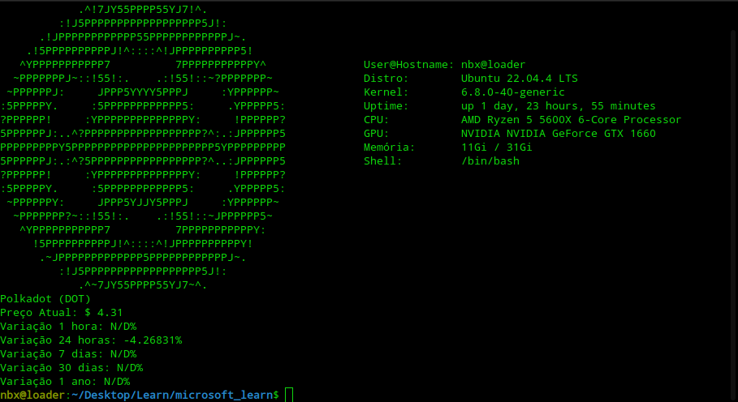

# README.md


# Polkafetch

´polkafetch` is a custom script based on neofetch that displays system information and Polkadot (DOT) data, including the current price and its variations.



## Prerequisites

Before using the script, ensure that you have the following installed on your system:

  - Bash (usually pre-installed on Linux systems)
  - Curl (to make HTTP requests)
  - JQ (to manipulate JSON returned by the CoinGecko API)

To install curl and jq, use the following commands:

Para instalar o `curl` e o `jq`, use os seguintes comandos:

```bash
sudo apt update
sudo apt install curl jq
```

## How to Use Polkafetch

Follow the steps below to download, configure, and run Polkafetch:
1. Clone the Repository

First, clone this repository to your local directory using Git:

```bash
git clone https://github.com/92username/polkafetch.git
```

### 2. Navigate to the Polkafetch Directory

Access the directory where the polkafetch.sh script was downloaded:

```bash
cd polkafetch
```

### 3. Make the Script Executable

To execute the polkafetch.sh script, you need to ensure it has execution permissions. Use the following command:

```bash
chmod +x polkafetch.sh
```

### 4. Run the Script

Now that the script is executable, you can run it with the following command:

```
./polkafetch.sh
```

To run Polkafetch by simply typing `polkafetch` in the terminal, you need to copy the script to /usr/local/bin or a similar directory that is in your PATH.

```
sudo cp polkafetch.sh /usr/local/bin/polkafetch
```
Now you can execute the script by simply typing:
```bash
polkafetch
```

### 5. Features
  - System Information: Displays detailed information about your system, including the user, Linux distribution, uptime, CPU, GPU, and memory.
  - Polkadot (DOT) Data: Fetches real-time Polkadot (DOT) cryptocurrency information such as current price and variations over 1 hour, 24 hours, 7 days, 30 days, and 1 year.
  - Customizable Display: Provides options to easily customize the display of system and cryptocurrency data.
  - Lightweight and Fast: Executes quickly and efficiently, making it ideal for users who want a simple yet informative system monitor.


### 6. Output

When you run `polkafetch`, you will see detailed information about your system, including the user, Linux distribution, uptime, CPU, GPU, memory, as well as information about Polkadot (DOT), such as the current price and its variations over 1 hour, 24 hours, 7 days, 30 days, and 1 year.

---

## Contribution

Contribution

If you would like to contribute with improvements, feel free to open a Pull Request or suggest changes through Issues. 
